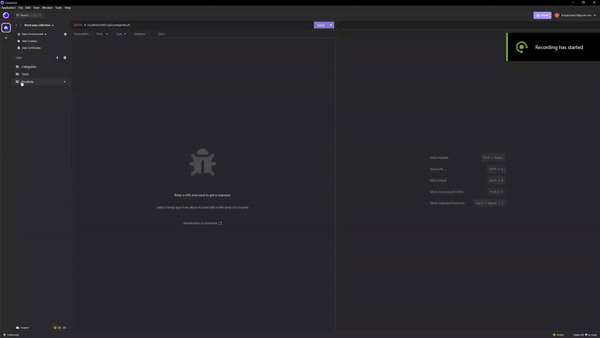

# E-Commerce-Project

## Description

This is the back end for an e-commerce site that will allow a user to view, update, create, and delete
items within the database housed on a local server. In order to first populate items PostgreSQL will
be used to drop the database and a seeds command to populate the database. Users will then need insomnia to
be able to navigate through the information as well as make changes. 

## Installation and Usage

Downloading the repo will download all dependencies and code needed to run the server.js. Be
sure to drop the sql database in order to create the table that will be used for the seeds. run
"node seeds" to drop initial seeds into the database, you will be able to see them in insomnia after
turning on the server. Please look at the env example and use your postgres information in an .env file
in order to access the server. Running "node server.js" will start up the server that will allow you
to use insomia to view all products, categories, and tags as well as update, delete, and create 
accordingly.  

## Demo

for a video walkthrough of the gif follow this links:

code and usage: https://www.youtube.com/watch?v=BuBE1e4_pfI

Full Insomnia walkthrough: https://youtu.be/rsEl-k_BemE

